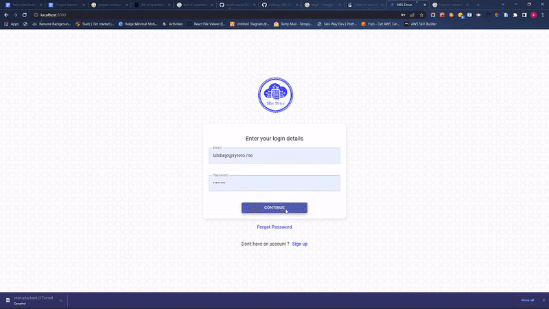
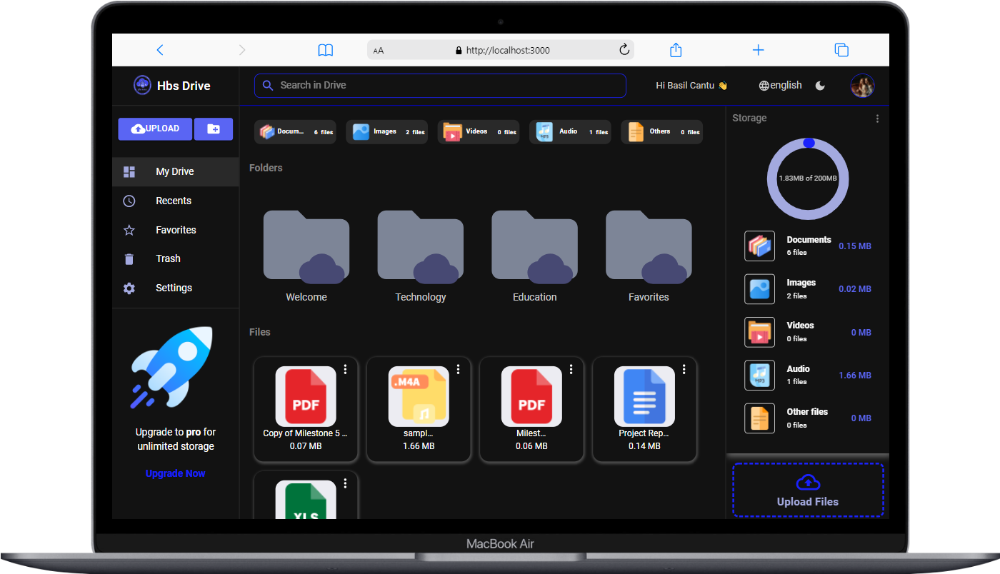

# Development of a Secured Cloud-Based Drive Application Exploiting Web technologies  
## Developed and Managed by Abdullah Sofiyullah Folorunsho (HR20190103865)
### A graduating student of Federal Polytechnic Ede, located in Osun state, Nigeria majoring in Computer engineering (Software Focused), HND.

This project was bootstrapped with [Create React App](https://github.com/facebook/create-react-app).


<div align="center">


# Hbs Drive🌩️ - Habsof drive

 <h3>A Cloud Based Drive Web Application.</h3>

[](https://app.netlify.com/sites/evolt-myspace/deploys)

 

</div>


## Table of Contents

- [Getting Started](#getting-started)
- [Live link](#live-link)
- [About](#about)
- [Technologies used](#-technologies-used)
- [Features](#features)
- [Screenshots](#screenshots)
- [Connect with me](#-connect-with-me)

## Getting Started

- Clone the repository on your local machine with the command below in your terminal, and cd into the **evolt-social** folder

```sh
git clone https://github.com/Precioussoul/HBS-DRIVE.git
cd HBS-DRIVE
```

- Install dependencies (if you are using **yarn** then do with that)

```sh
yarn install
```

- Create a `.env` file at the root level of the directory (at the level of `package.json`) and create a environment variables and use process.env to initialize them.

``` 
REACT_APP_FIREBASE_API_KEY= <YOUR API KEY>
REACT_APP_FIREBASE_AUTH_DOMAIN= <YOUR CLOUD AUTH DOMAIN>
REACT_APP_FIREBASE_PROJECT_ID=<YOUR PROJECT ID>
REACT_APP_FIREBASE_STORAGE_BUCKET=<YOUR CLOUD STORAGE BUCKET ID>
REACT_APP_FIREBASE_MESSAGE_SENDER_ID= <YOUR SENDER ID>
REACT_APP_FIREBASE_APP_ID=<YOUR GENERATED APP ID>
```

- Start the development server🚀

```
yarn start
 
Runs the app in the development mode.\
Open [http://localhost:3000](http://localhost:3000) to view it in your browser.

The page will reload when you make changes.\
You may also see any lint errors in the console.

```

## Live link

 https://hbs-drive.web.app/
## About

- Hbs drive is a cloud-based drive web app that allow users to have access to cloud storage from the comfort of their home and location.
- Users can share files with others, upload, starred, delete, and recover their files and folders. A Shareable links to share files with loved ones around the world.

## 🛠 Technologies used

- HTML
- JavaScript 
- ReactJS
- React ContextAPI
- React Router 
- SASS (Scss)
- Material UI
- Other NPM libraries for React
- Firebase (Backend as a Service)
- Firestore Cloud Database
- Firebase Cloud Storage Bucket
- Firebase Authentication
- Node Package Manager (NodeJS) 
- Git

## Features

**My Drive**:

- User will able to see all his files uploaded and folder created
- File can be liked and deleted and files links can be shared
- File can be previewed and also previewed in new tab with single click

**Recents**

- All the new users files and folders will be shown over here.

**Search**

- User can search for files and folder quickly
- Implemented `debounce` for search.

**Favorites/Starred**

 - All the new users favorite/ starred files and folders will be shown over here.

**Trash**
 - All the new users deleted files and folders will be shown over here.


**Profile Settings**

- User can view there profile 
- Each user can edit there profile.


**Authentication**

- HBS DRIVE has login, signup and logout feature.
- A new user can also login using test credentials.
- For Signup, form validation is done for all the fields.

**Dark mode**

- Has light and dark mode.

## Screenshots

<!--    -->
<div display='flex'>
    
     

  
</div>

## 👨‍💻 Connect with me

<a href="https://twitter.com/sofiyullah_dev"></a>
<a href="https://www.linkedin.com/in/sofiyullah-abdullah/"></a>
© 2022 GitHub, Inc.
 

## Learn More

You can learn more in the [Create React App documentation](https://facebook.github.io/create-react-app/docs/getting-started).

To learn React, check out the [React documentation](https://reactjs.org/).
To learn Firebase, check out the [Firebase documentation](https://firebase.google.com/docs).
 
